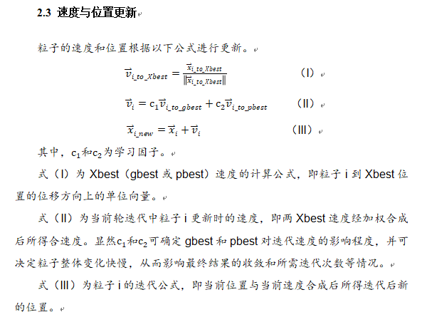

# Optimzation-Package
用于练手的、参考用的、基础的优化算法包

From一个小蒟蒻的考前复习，以提前练习考试手写代码

可供入门级学习与讨论用，此处仅提供代码，对于算法的学习，互联网资源众多肯定比我个萌新讲得好。

另，如果各位犇犇有什么问题、建议及批评意见，欢迎提出以帮助我这个小萌新的成长orz，同时也支持和我一样的萌新与我一起探讨学习！

## 2024-11-13
更新了PSO算法

### 粒子群优化
粒子群优化（PSO, Particle Swarm Optimization）算法是一种模拟鸟群觅食行为的优化算法，由Kennedy和Eberhart于1995年提出。它是一种群体智能算法，旨在通过群体中每个个体（粒子）的位置和速度更新规则，寻找问题的最优解。

- #### algorithm.py
对于pso算法的简单实现。

- #### exploration.py
也就是把上机实验的代码也传上来了……会有一些简单的可视化，速度迭代的公式也通过自己的理解稍微改了一下下（其实能看出来是先写的exploration再有的algorithm...）

有点懒得写了，此处引用自己的课程实验报告进行个小说明。

---
Name-eee，想摆烂且爱捡漏的大三备战考研党

Email：chuyueming_flu@163.com